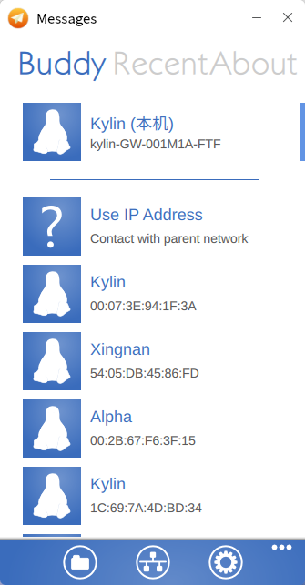
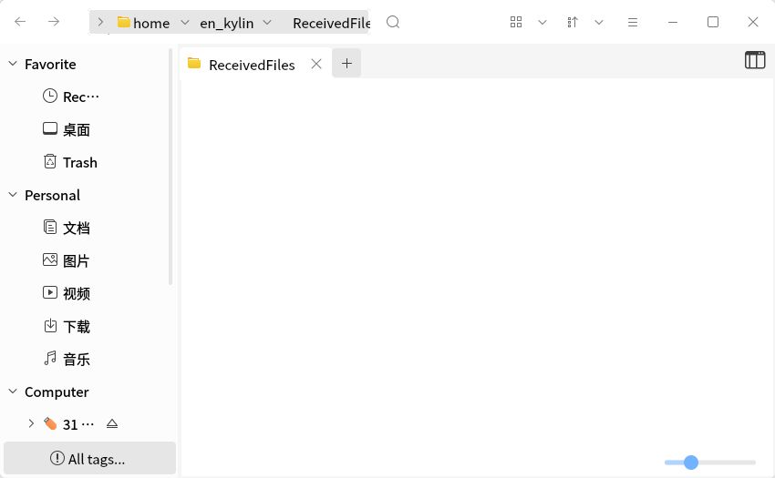
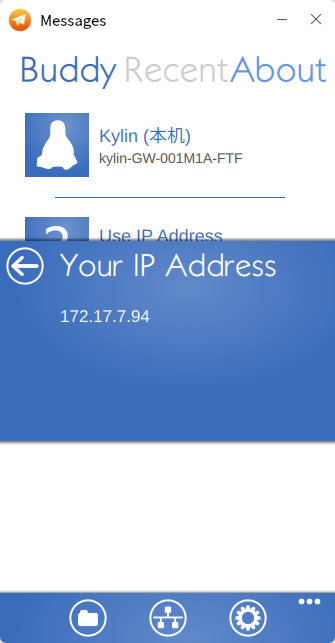
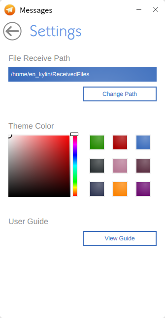
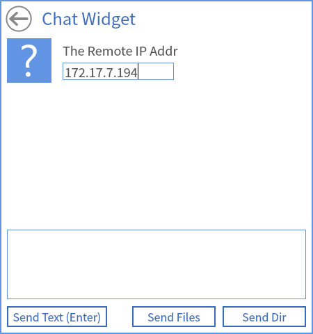
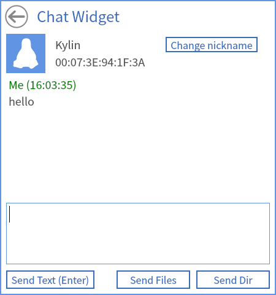
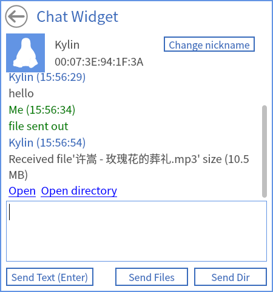
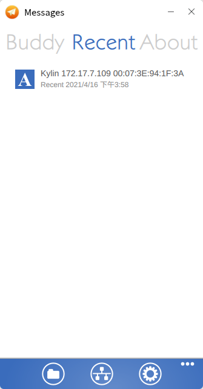

# Messages
## Overview
Messages is a cross platforms, efficient text/files transfer tool. And in order to avoid overwriting the original files, it will compare with the local file name when users transfer files.

All the functions are completed without server. 

 

## View Received Files
Click , as shown in Fig 2.

 

## View Local IP Address
Click , as shown in Fig 3.

 

## Settings
Click  to change the receive path and theme color, as shown in Fig 4.

## Chatting Interface
### Add Other Users
The users in the same LAN will be shown on the main interface. 

Click "Use IP Address" to add a new user, as shown in Fig 5.

### Chatting
The interface as shown in Fig 6. 

### Send Messages
There are three button at the bottom of the window: Send Text, Send Files and Send Dir.

"Send Files" supports to transfer multiple files at a time.

### Receive Messages
As shown in Fig 8.

 

## Recent
It shows the communication recorders, and click one recorder to open the corresponding chatting window.

 

## About
Click "About" in the main interface to see the details of Messages.
