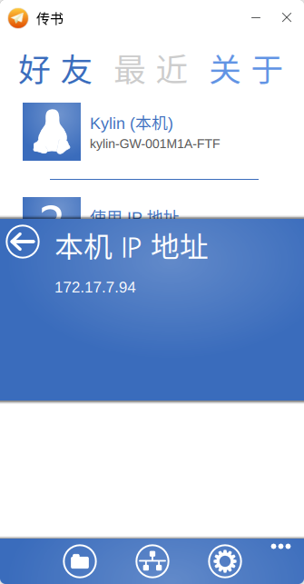
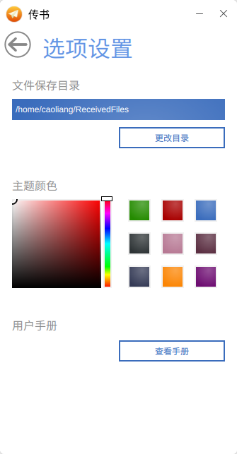
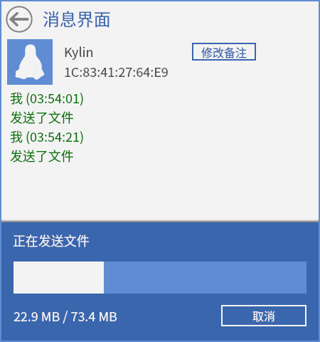

# 传书
## 概 述
传书是一个跨平台、高效的文字/文件传输工具。在用户传输文件时，会与本地文件名相互比较，避免覆盖原有的文件，损失重要信息。

传书无服务器设计，所有功能通过客户端完成。

 

### 查看已接收文件
点击“”图标，查看已接收文件，如图2所示。

### 查看本机IP地址
点击“”图标，查看本机IP地址。

### 设 置
点击“”图标，可修改文件保存目录和主题颜色，如图4所示。

### 消息界面
点击“使用IP地址”向其他用户发送消息，如图5所示。

### 发送消息
聊天窗口底部有三个按钮：发消息，传文件，传文件夹。

“传文件”支持一次传输多个文件。

### 最近和关于
在主界面有三个标签页，点击“最近”，则切换到最近交谈消息管理页面。点击列表记录中的某条记录，则弹出与该用户通信的消息对话框，并显示之前的交谈记录。

点击“关于”，可查看传书关于信息。
